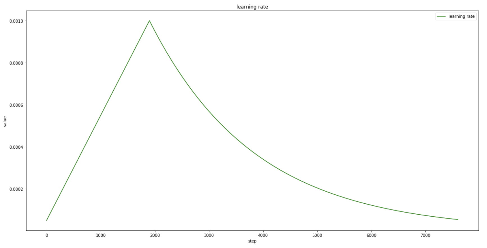
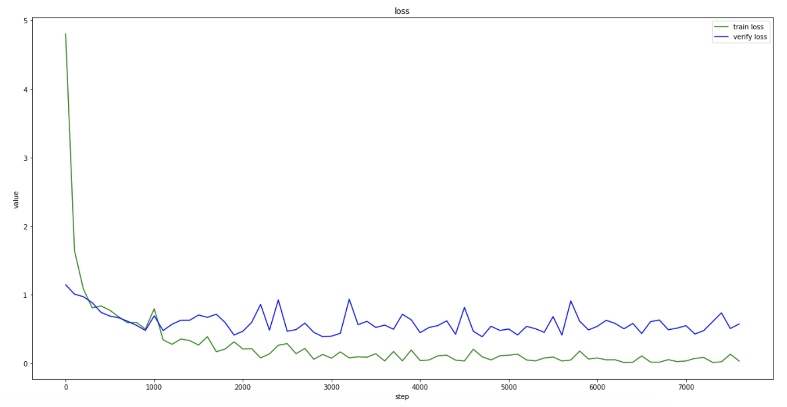
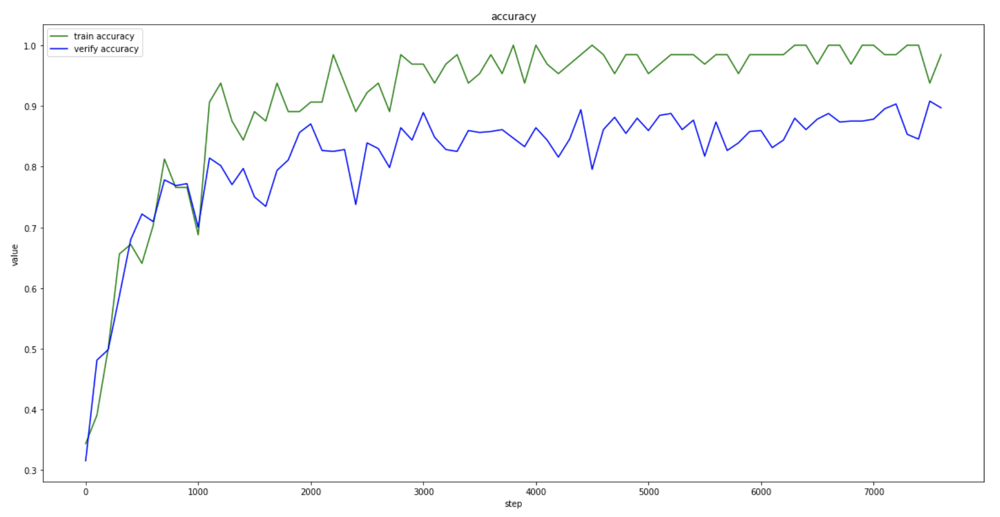
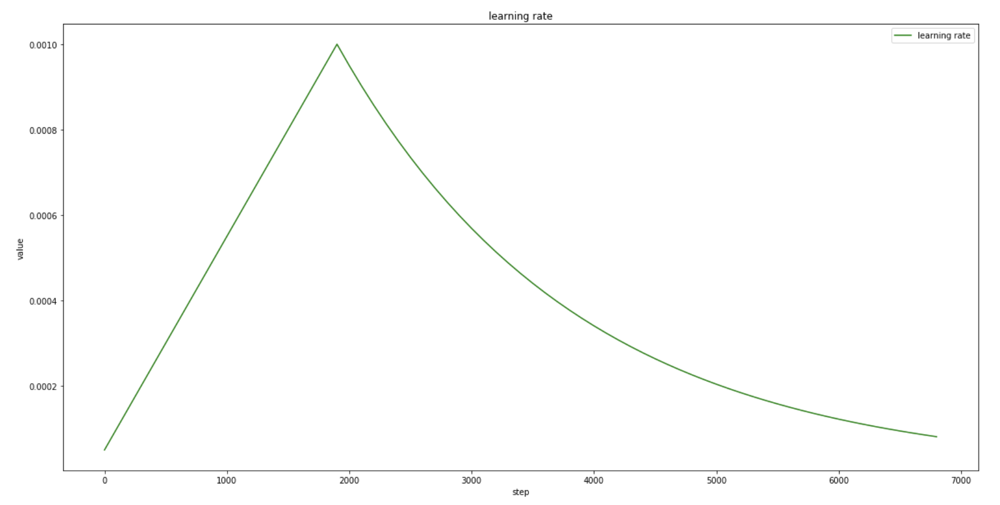
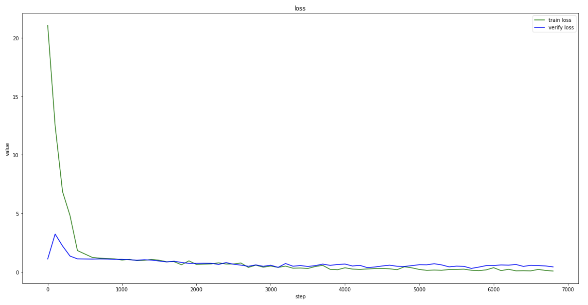
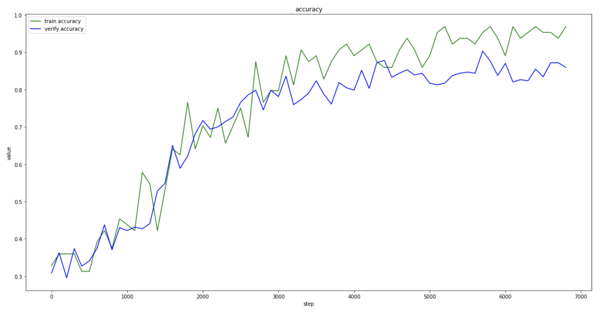
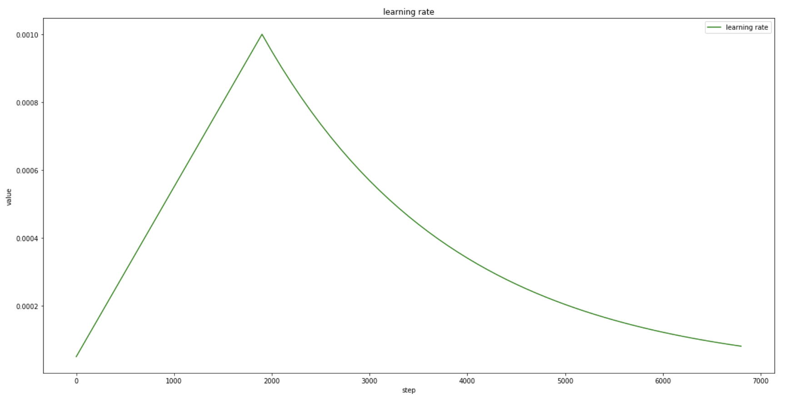
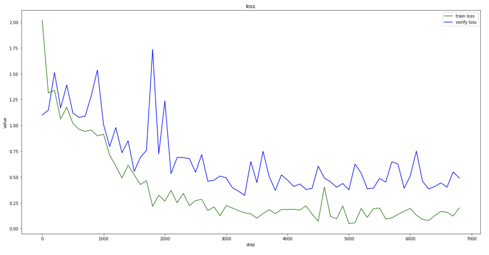
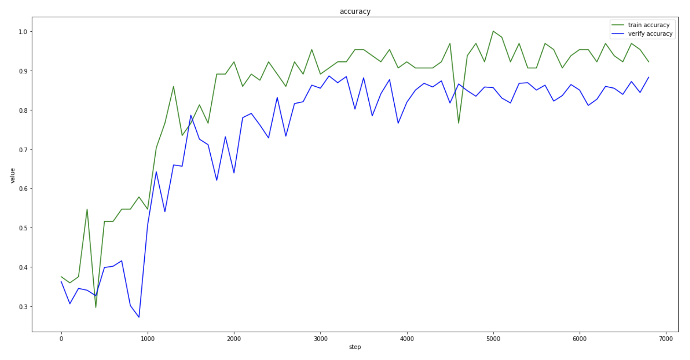

# 先心病检测模型1.0

## 一、文件信息

##### 1、文件夹：

imgaug_files：imgaug.md存储的数据增强图片

model1：model1模型参数存储（后续补充）

model2：model2模型参数存储（后续补充）

Model3：model3模型参数存储（后续补充）

##### 2、文件：

data_augment.py：数据增强函数

data_progress.ipynb：数据处理

data_generator：数据生成迭代器

Dictionary.py：字典

imgaug.md：数据增强函数和效果展示

inception.py：InceptionV4模型代码

main.py：训练执行文件

model.py：YoloV3模型代码和AlexNet改动后的模型代码

test.py：测试函数文件

tools.py：工具函数

train.py：训练函数文件

test.csv：三个模型的训练准确率和测试效果

## 二、使用模型

model1：model.py文件中的Net1模型，是以AlexNet模型改动的。（不拟合）

model2：inception.py文件中的Inception_FPN模型，是InceptionV4的基础上在全连接层前加入了类似FPN结构的特征提取方式的和空间注意力机制的模型。（acc=0.8）

model3：model.py文件中的Classifier模型，是YoloV3加入空间注意力机制改动后的模型。（acc=0.84）

## 三、数据集

##### 1、原始数据：

先心病的有三批数据，

第一批为已经抽取帧的图片，有正例 330 人，ASD 40 人， VSD 146人。

第二批与第三批均为视频，总共大概有正例 452 人 ，ASD 176人 ，VSD 336人。

##### 2、数据处理：

（1）视频数据抽取图片是每隔10帧从视频中抽一帧，抽5个切面的最小帧数，由于文件命名不一致，所以同一样本的5个切面的视频是根据时间判断的，其中有缺失切面的样本也会由最小时间间隔匹配到其他切面进行补充。

（2）数据用一个扇形的mask来取有效区域，然后crop出一个合适大小的矩形。

（3）最终数据集图片数量加起来有正例3856张、 ASD891张和VSD1270张，数据集按照8：1：1分为训练集、验证集和测试集，之后训练集、验证集和测试集均进行过采样使样本中正例、ASD和VSD数量比接近1：1：1。

数据处理代码和详细参数设置在data_progress.ipynb中

##### 3、最终数据集：

（1）dataset5C：即经过1、2步骤得到的数据集。

（2）dataset5CR：在dataset5C的基础上进行了负例样本的5通道随机组合，增强负例样本。

（3）dataset5CRS：在dataset5CR基础上进一步crop了一个更小的矩形。

目前只采用mutil-view训练模型。

##### 4、训练数据增强：

（1）采用了imgaug库中的图像处理函数，从该库中挑选了一些适合于先心病超声图像增强的函数，具体函数、参数和效果见imgaug.md文件，data_augment.py为最终训练时用的数据增强函数。

（2）采用α=0.4的mixup。

## 四、模型训练

##### 1、超参数：

学习率：初始学习率0.001，采用warmup，从0.00005到0.001再到0.001*0.95**epoch

Batchsize：32

Epoch：100

optimizer：Adam，β1β2为默认值0.9和0.999，weight_decay=0.0005

初始化：使用xavier_normal_初始化，其中残差单元中最后一个BatchNorm2d中的参数初始化为0

loss：使用CrossEntropyLoss，权值为[0.9,1,1]，正例为0.9

##### 2、训练结果：

（1）model1 DSC模型

lr 变化曲线：

loss 变化曲线：

acc 变化曲线：

（2）model2 inceptionV4模型

lr 变化曲线：

loss 变化曲线：

acc 变化曲线：

（3）model3 YoloV3模型

lr 变化曲线：

loss 变化曲线：

acc 变化曲线：

