# 数据增强

```python
from imgaug import *
import imgaug.augmenters as iaa
import matplotlib.pyplot as plt
import cv2 as cv
import numpy as np
```


```python
im = cv.imread('./1.jpg')
plt.figure(figsize=(4,4))
plt.axis('off')
plt.imshow(im)
plt.show()
```

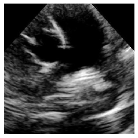


```python
img = []
for i in range(8):
    img.append(im)
img = np.array(img)
seq = iaa.Sequential([iaa.Identity()])#保持原样
img = seq(images = img)
plt.figure(figsize=(20,10))
for i in range(8):
    plt.subplot(2,4,i+1)
    plt.axis('off')
    plt.imshow(img[i])
plt.show()
```


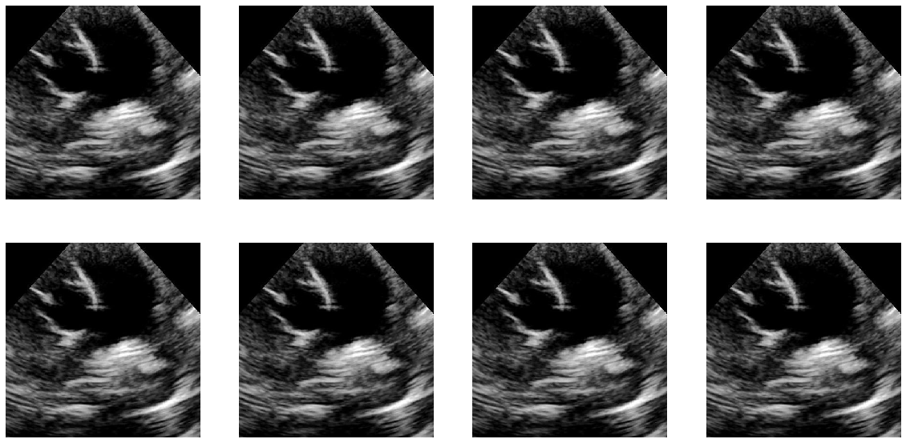


```python
img = []
for i in range(8):
    img.append(im)
img = np.array(img)
seq = iaa.Sequential([iaa.Add((-40, 40))])#加减像素
img = seq(images = img)
plt.figure(figsize=(20,10))
for i in range(8):
    plt.subplot(2,4,i+1)
    plt.axis('off')
    plt.imshow(img[i])
plt.show()
```


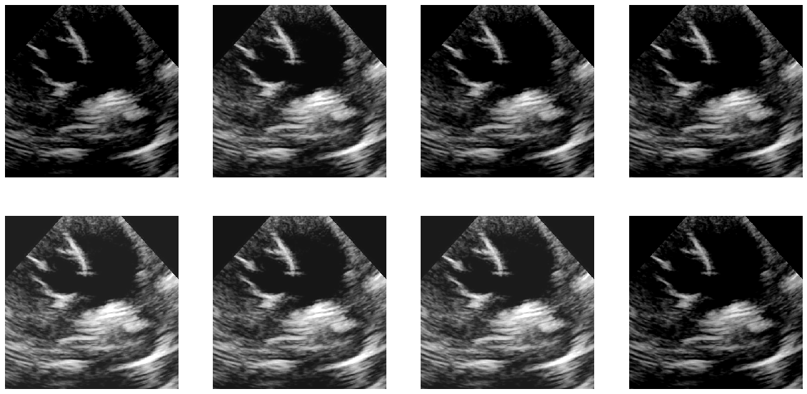


```python
img = []
for i in range(8):
    img.append(im)
img = np.array(img)
seq = iaa.Sequential([iaa.AddElementwise((-40, 40))])# Add random values between -40 and 40 to images,
                                                    #with each value being sampled per pixel:
img = seq(images = img)
plt.figure(figsize=(20,10))
for i in range(8):
    plt.subplot(2,4,i+1)
    plt.axis('off')
    plt.imshow(img[i])
plt.show()
```


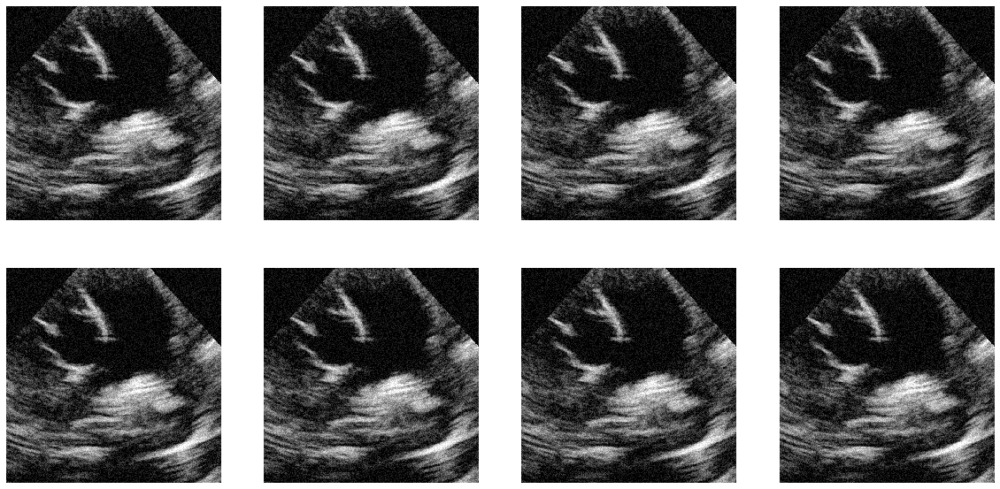


```python
img = []
for i in range(8):
    img.append(im)
img = np.array(img)
seq = iaa.Sequential([iaa.AdditiveGaussianNoise(scale=(0, 0.2*255))])#高斯噪声
img = seq(images = img)
plt.figure(figsize=(20,10))
for i in range(8):
    plt.subplot(2,4,i+1)
    plt.axis('off')
    plt.imshow(img[i])
plt.show()
```


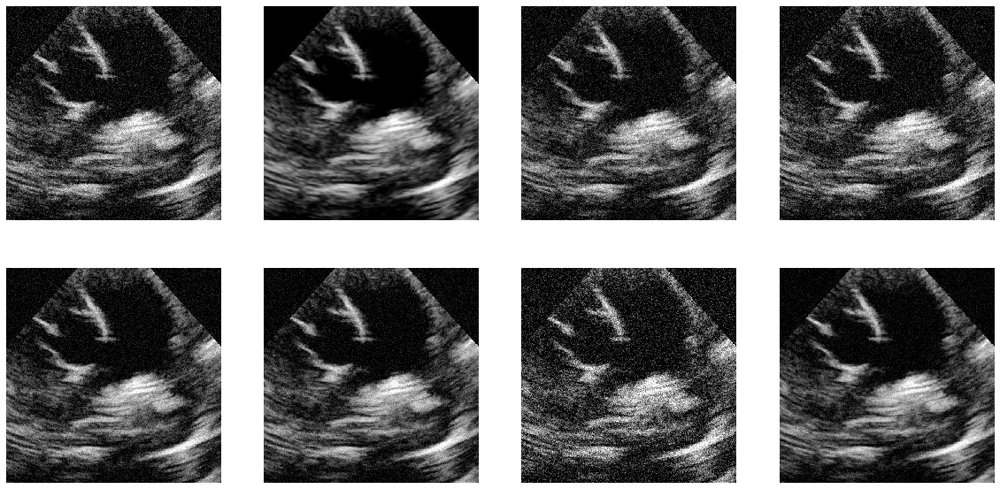


```python
img = []
for i in range(8):
    img.append(im)
img = np.array(img)
seq = iaa.Sequential([iaa.AdditiveLaplaceNoise(scale=(0, 0.2*255))])#拉普拉斯噪声
img = seq(images = img)
plt.figure(figsize=(20,10))
for i in range(8):
    plt.subplot(2,4,i+1)
    plt.axis('off')
    plt.imshow(img[i])
plt.show()
```


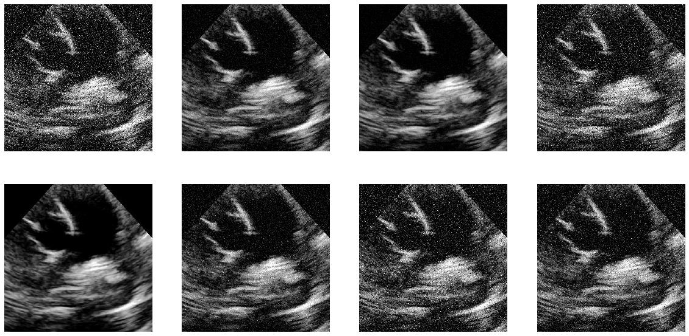


```python
img = []
for i in range(8):
    img.append(im)
img = np.array(img)
seq = iaa.Sequential([iaa.AdditivePoissonNoise((0, 40))])#泊松噪声
img = seq(images = img)
plt.figure(figsize=(20,10))
for i in range(8):
    plt.subplot(2,4,i+1)
    plt.axis('off')
    plt.imshow(img[i])
plt.show()
```


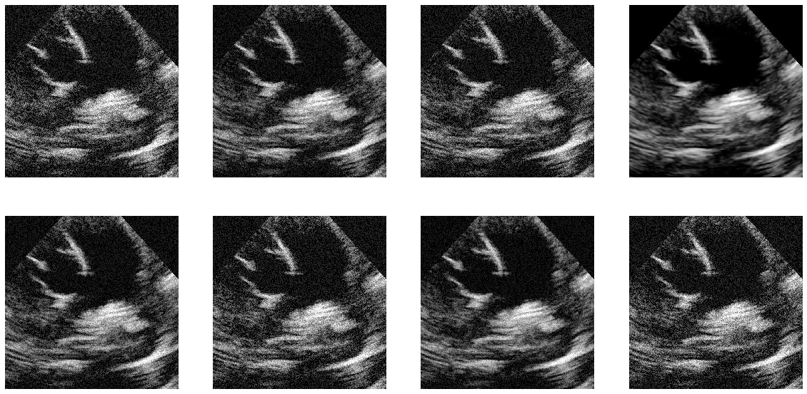


```python
img = []
for i in range(8):
    img.append(im)
img = np.array(img)
seq = iaa.Sequential([iaa.AdditivePoissonNoise((0, 40))])#泊松噪声
img = seq(images = img)
plt.figure(figsize=(20,10))
for i in range(8):
    plt.subplot(2,4,i+1)
    plt.axis('off')
    plt.imshow(img[i])
plt.show()
```


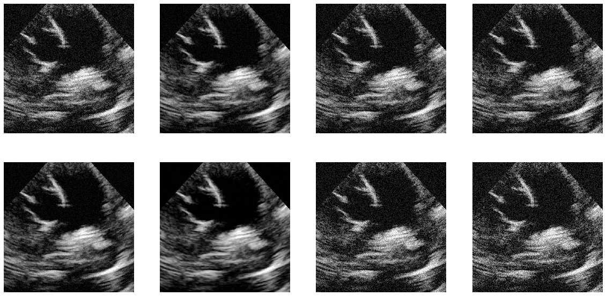


```python
img = []
for i in range(8):
    img.append(im)
img = np.array(img)
seq = iaa.Sequential([iaa.MultiplyElementwise((0.5, 1.5))])#Multipl yeach pixel with a random value between 
img = seq(images = img)
plt.figure(figsize=(20,10))
for i in range(8):
    plt.subplot(2,4,i+1)
    plt.axis('off')
    plt.imshow(img[i])
plt.show()
```


```python
img = []
for i in range(8):
    img.append(im)
img = np.array(img)
seq = iaa.Sequential([iaa.Cutout(nb_iterations=2,size=0.15,cval=0,squared=False)])#随机块
img = seq(images = img)
plt.figure(figsize=(20,10))
for i in range(8):
    plt.subplot(2,4,i+1)
    plt.axis('off')
    plt.imshow(img[i])
plt.show()
```


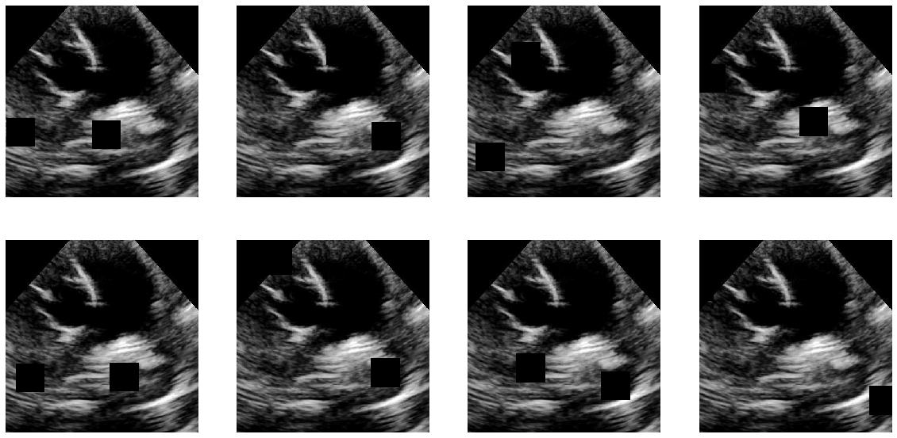


```python
img = []
for i in range(8):
    img.append(im)
img = np.array(img)
seq = iaa.Sequential([iaa.Dropout(p=(0, 0.2))])#Dropout
img = seq(images = img)
plt.figure(figsize=(20,10))
for i in range(8):
    plt.subplot(2,4,i+1)
    plt.axis('off')
    plt.imshow(img[i])
plt.show()
```


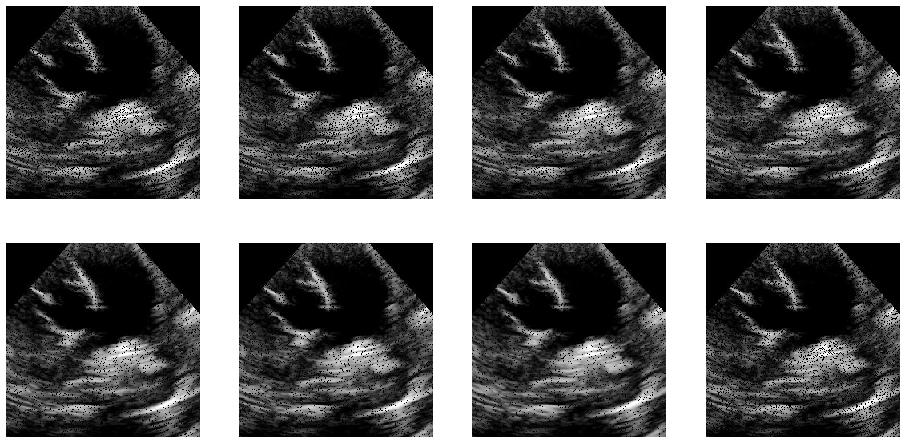


```python
img = []
for i in range(8):
    img.append(im)
img = np.array(img)
seq = iaa.Sequential([iaa.CoarseDropout((0.0, 0.05), size_percent=(0.02, 0.25))])#Dropout块
img = seq(images = img)
plt.figure(figsize=(20,10))
for i in range(8):
    plt.subplot(2,4,i+1)
    plt.axis('off')
    plt.imshow(img[i])
plt.show()
```


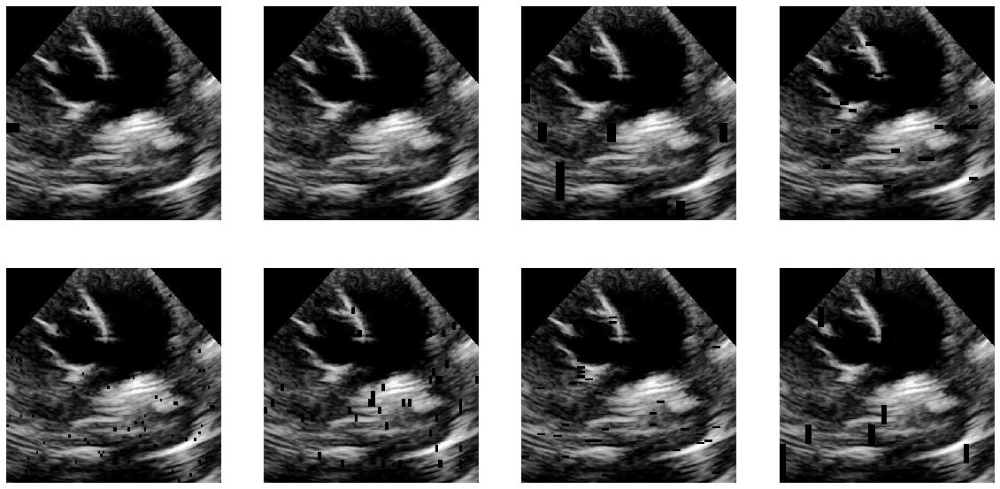


```python
img = []
for i in range(8):
    img.append(im)
img = np.array(img)
seq = iaa.Sequential([iaa.ReplaceElementwise(0.1, [0, 255])])#噪声
img = seq(images = img)
plt.figure(figsize=(20,10))
for i in range(8):
    plt.subplot(2,4,i+1)
    plt.axis('off')
    plt.imshow(img[i])
plt.show()
```


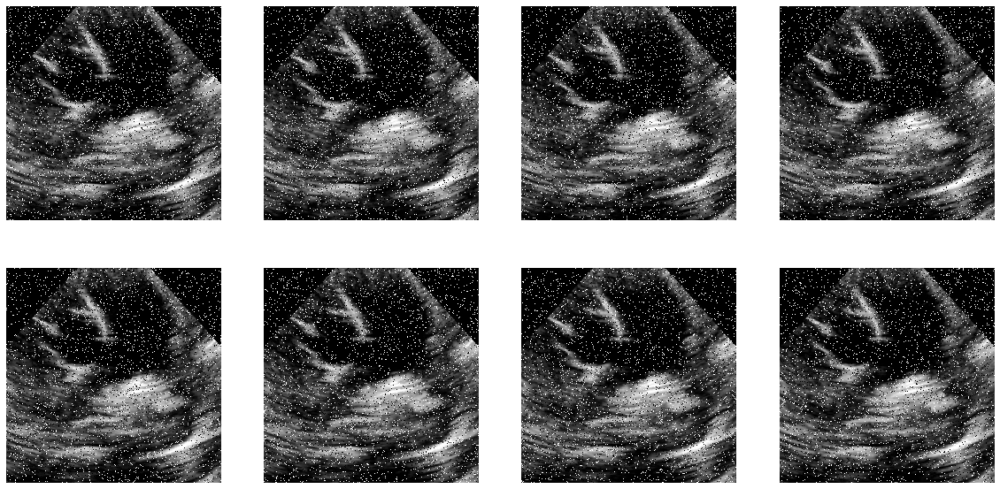


```python
img = []
for i in range(8):
    img.append(im)
img = np.array(img)
seq = iaa.Sequential([iaa.SaltAndPepper(0.1)])#椒盐噪声
img = seq(images = img)
plt.figure(figsize=(20,10))
for i in range(8):
    plt.subplot(2,4,i+1)
    plt.axis('off')
    plt.imshow(img[i])
plt.show()
```


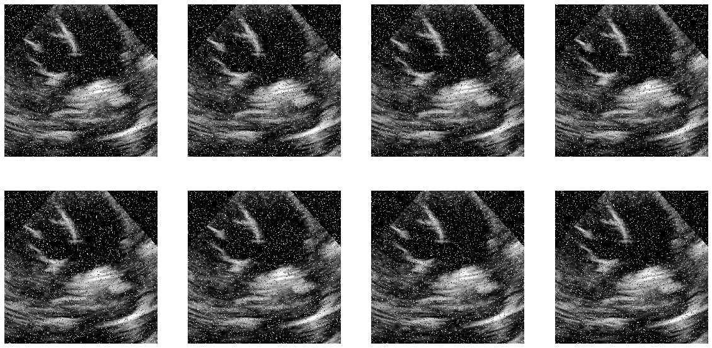


```python
img = []
for i in range(8):
    img.append(im)
img = np.array(img)
seq = iaa.Sequential([iaa.CoarseSaltAndPepper(0.05, size_percent=(0.01, 0.1))])#噪声块
img = seq(images = img)
plt.figure(figsize=(20,10))
for i in range(8):
    plt.subplot(2,4,i+1)
    plt.axis('off')
    plt.imshow(img[i])
plt.show()
```


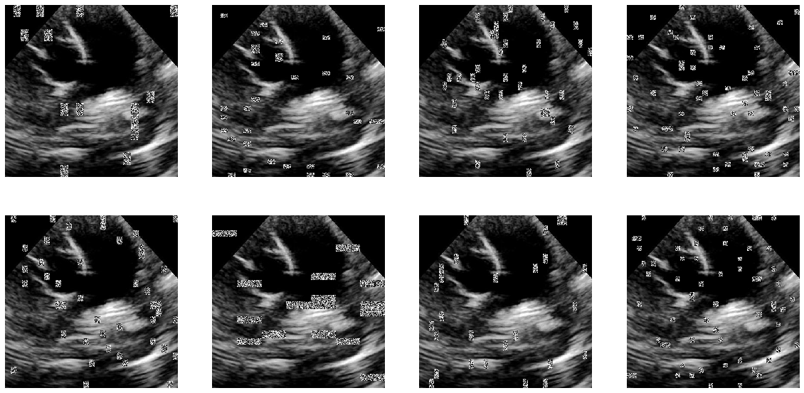


```python
img = []
for i in range(8):
    img.append(im)
img = np.array(img)
seq = iaa.Sequential([iaa.Cartoon()])#carton
img = seq(images = img)
plt.figure(figsize=(20,10))
for i in range(8):
    plt.subplot(2,4,i+1)
    plt.axis('off')
    plt.imshow(img[i])
plt.show()
```


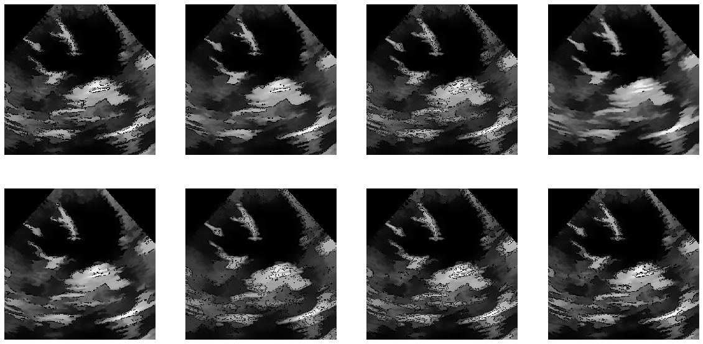


```python
img = []
for i in range(8):
    img.append(im)
img = np.array(img)
seq = iaa.Sequential([iaa.BlendAlphaVerticalLinearGradient(
    iaa.TotalDropout(1.0),
    min_value=0.2, max_value=0.8)]
                    )#Dropout块
img = seq(images = img)
plt.figure(figsize=(20,10))
for i in range(8):
    plt.subplot(2,4,i+1)
    plt.axis('off')
    plt.imshow(img[i])
plt.show()
```


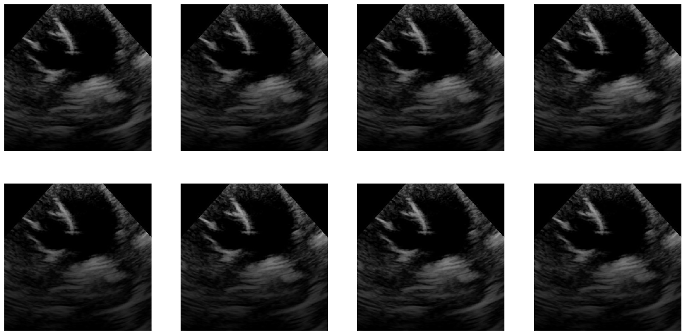


```python
img = []
for i in range(8):
    img.append(im)
img = np.array(img)
seq = iaa.Sequential([iaa.GaussianBlur(sigma=(0.0, 3.0))])#高斯滤波
img = seq(images = img)
plt.figure(figsize=(20,10))
for i in range(8):
    plt.subplot(2,4,i+1)
    plt.axis('off')
    plt.imshow(img[i])
plt.show()
```


```python
img = []
for i in range(8):
    img.append(im)
img = np.array(img)
seq = iaa.Sequential([iaa.AverageBlur(k=(2, 11))])#均值滤波
img = seq(images = img)
plt.figure(figsize=(20,10))
for i in range(8):
    plt.subplot(2,4,i+1)
    plt.axis('off')
    plt.imshow(img[i])
plt.show()
```


```python
img = []
for i in range(8):
    img.append(im)
img = np.array(img)
seq = iaa.Sequential([iaa.MedianBlur(k=(3, 11))])#中值滤波
img = seq(images = img)
plt.figure(figsize=(20,10))
for i in range(8):
    plt.subplot(2,4,i+1)
    plt.axis('off')
    plt.imshow(img[i])
plt.show()
```


```python
img = []
for i in range(8):
    img.append(im)
img = np.array(img)
seq = iaa.Sequential([iaa.BilateralBlur(
    d=(3, 10), sigma_color=(10, 250), sigma_space=(10, 250))])#双边滤波
img = seq(images = img)
plt.figure(figsize=(20,10))
for i in range(8):
    plt.subplot(2,4,i+1)
    plt.axis('off')
    plt.imshow(img[i])
plt.show()
```


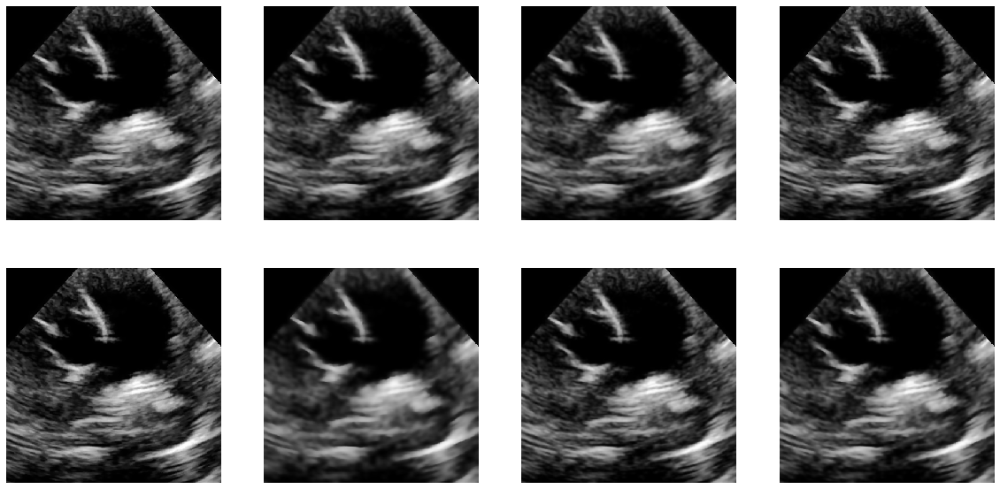


```python
img = []
for i in range(8):
    img.append(im)
img = np.array(img)
seq = iaa.Sequential([iaa.MotionBlur(k=20)])#motion blur 
img = seq(images = img)
plt.figure(figsize=(20,10))
for i in range(8):
    plt.subplot(2,4,i+1)
    plt.axis('off')
    plt.imshow(img[i])
plt.show()
```


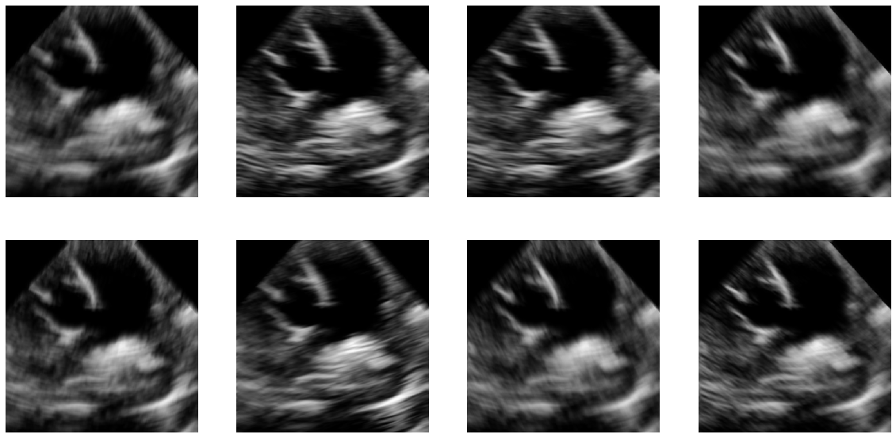


```python
img = []
for i in range(8):
    img.append(im)
img = np.array(img)
seq = iaa.Sequential([iaa.RandAugment(n=2, m=9)])#Rand
img = seq(images = img)
plt.figure(figsize=(20,10))
for i in range(8):
    plt.subplot(2,4,i+1)
    plt.axis('off')
    plt.imshow(img[i])
plt.show()
```


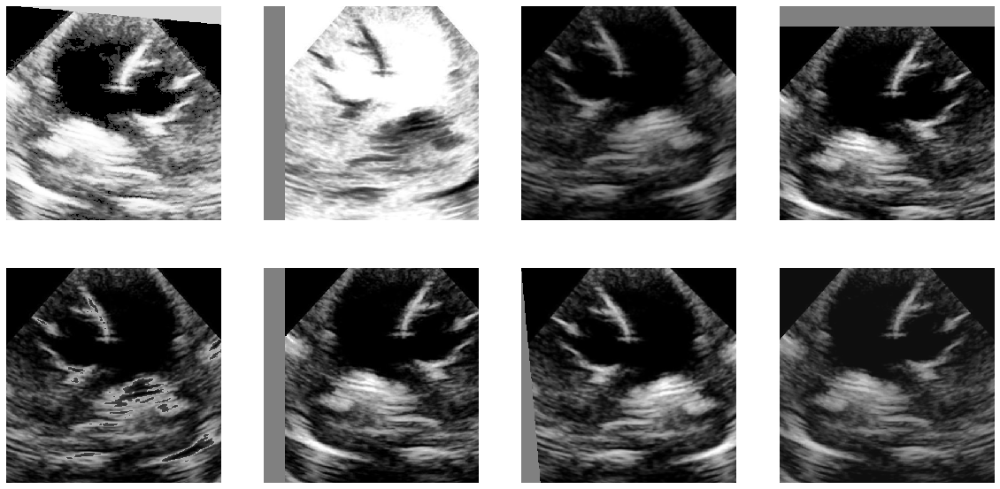


```python
img = []
for i in range(8):
    img.append(im)
img = np.array(img)
seq = iaa.Sequential([iaa.RandAugment(n=(0, 3),m=(0,9))])#Rand
img = seq(images = img)
plt.figure(figsize=(20,10))
for i in range(8):
    plt.subplot(2,4,i+1)
    plt.axis('off')
    plt.imshow(img[i])
plt.show()
```


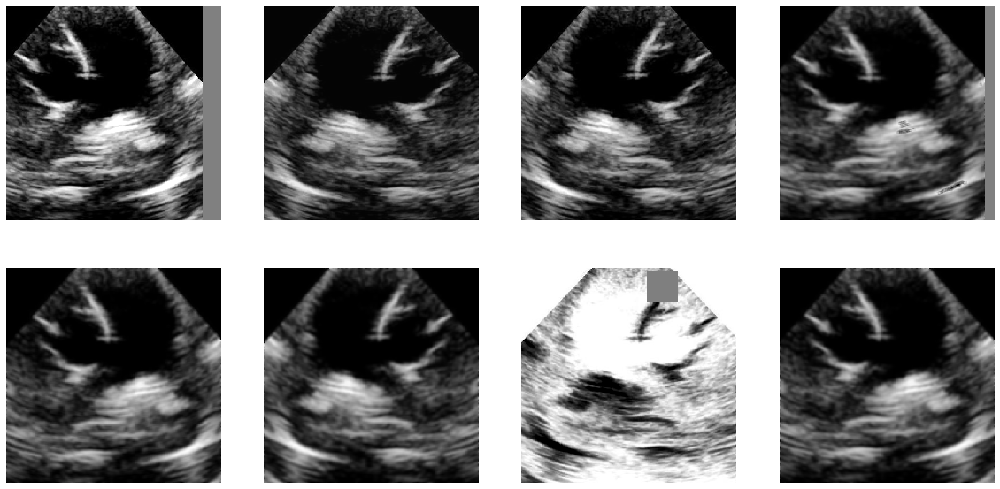


```python
img = []
for i in range(8):
    img.append(im)
img = np.array(img)
seq = iaa.Sequential([iaa.GammaContrast((0.5, 2.0))])#对比度
img = seq(images = img)
plt.figure(figsize=(20,10))
for i in range(8):
    plt.subplot(2,4,i+1)
    plt.axis('off')
    plt.imshow(img[i])
plt.show()
```


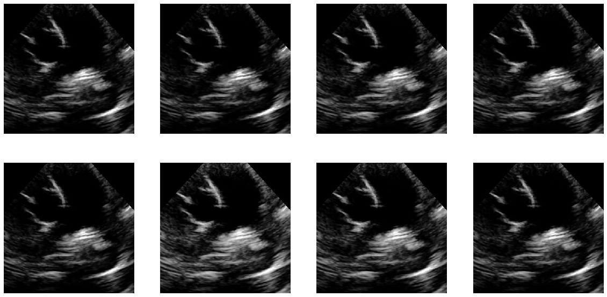


```python
img = []
for i in range(8):
    img.append(im)
img = np.array(img)
seq = iaa.Sequential([iaa.SigmoidContrast(gain=(3, 10), cutoff=(0.4, 0.6))])#sigmoid对比度
img = seq(images = img)
plt.figure(figsize=(20,10))
for i in range(8):
    plt.subplot(2,4,i+1)
    plt.axis('off')
    plt.imshow(img[i])
plt.show()
```


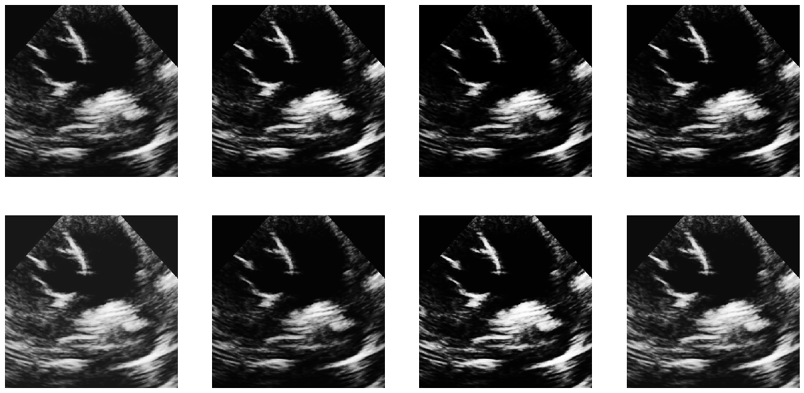


```python
img = []
for i in range(8):
    img.append(im)
img = np.array(img)
seq = iaa.Sequential([iaa.LogContrast(gain=(0.6, 1.4))])#Log对比度
img = seq(images = img)
plt.figure(figsize=(20,10))
for i in range(8):
    plt.subplot(2,4,i+1)
    plt.axis('off')
    plt.imshow(img[i])
plt.show()
```


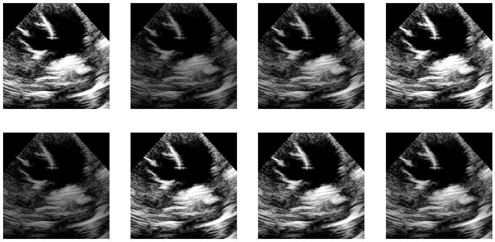


```python
img = []
for i in range(8):
    img.append(im)
img = np.array(img)
seq = iaa.Sequential([iaa.LinearContrast((0.4, 1.6))])#Linear对比度
img = seq(images = img)
plt.figure(figsize=(20,10))
for i in range(8):
    plt.subplot(2,4,i+1)
    plt.axis('off')
    plt.imshow(img[i])
plt.show()
```


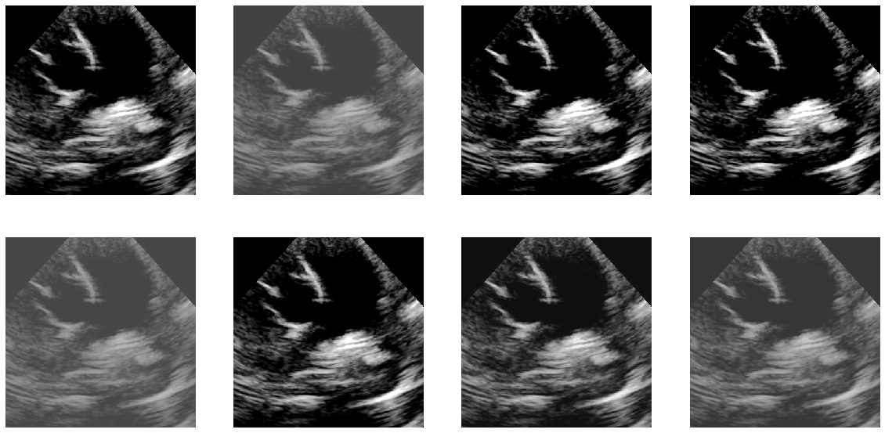


```python
img = []
for i in range(8):
    img.append(im)
img = np.array(img)
seq = iaa.Sequential([iaa.AllChannelsCLAHE()])#直方图均衡化
img = seq(images = img)
plt.figure(figsize=(20,10))
for i in range(8):
    plt.subplot(2,4,i+1)
    plt.axis('off')
    plt.imshow(img[i])
plt.show()
```


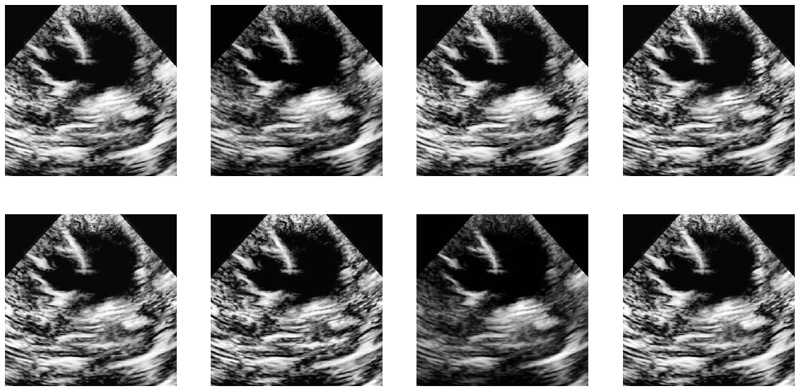


```python
img = []
for i in range(8):
    img.append(im)
img = np.array(img)
seq = iaa.Sequential([iaa.Sharpen(alpha=(0.0, 1.0), lightness=(0.75, 2.0))])#锐化
img = seq(images = img)
plt.figure(figsize=(20,10))
for i in range(8):
    plt.subplot(2,4,i+1)
    plt.axis('off')
    plt.imshow(img[i])
plt.show()
```


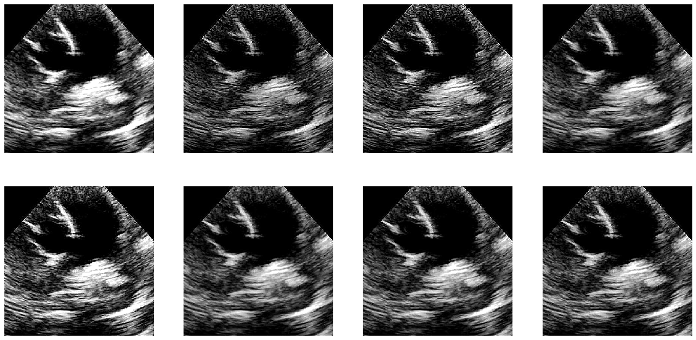


```python
img = []
for i in range(8):
    img.append(im)
img = np.array(img)
seq = iaa.Sequential([iaa.Emboss(alpha=(0.0, 1.0), strength=(0.5, 1.5))])#Emboss
img = seq(images = img)
plt.figure(figsize=(20,10))
for i in range(8):
    plt.subplot(2,4,i+1)
    plt.axis('off')
    plt.imshow(img[i])
plt.show()
```


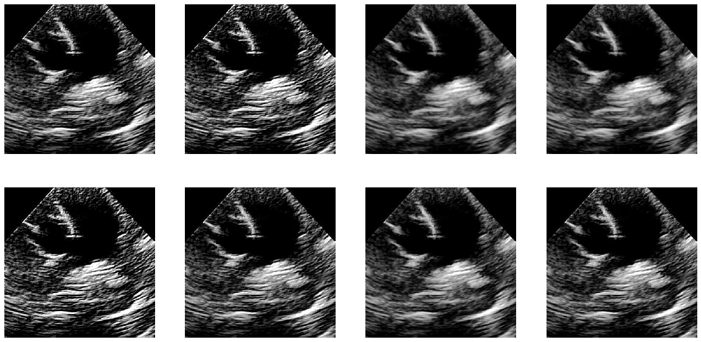


```python
img = []
for i in range(8):
    img.append(im)
img = np.array(img)
seq = iaa.Sequential([iaa.Fliplr(0.5)])#左右翻转
img = seq(images = img)
plt.figure(figsize=(20,10))
for i in range(8):
    plt.subplot(2,4,i+1)
    plt.axis('off')
    plt.imshow(img[i])
plt.show()
```


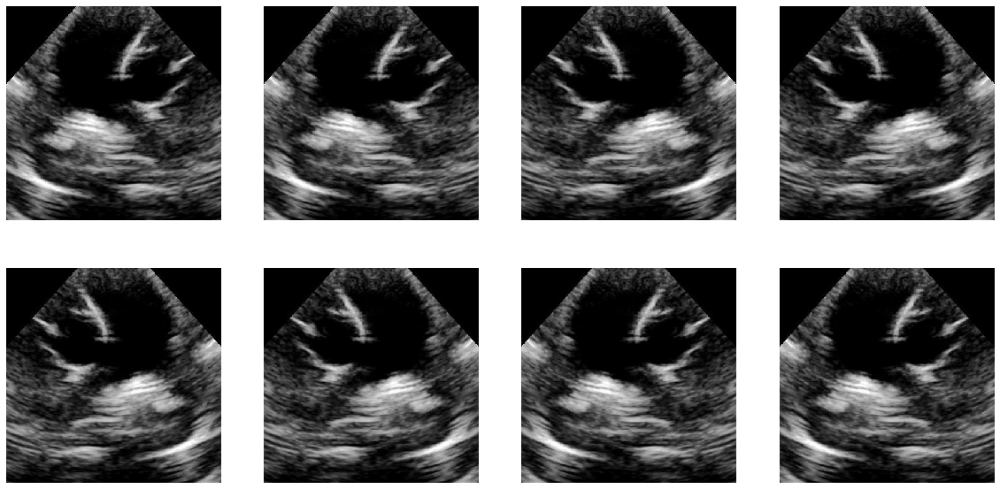


```python
img = []
for i in range(8):
    img.append(im)
img = np.array(img)
seq = iaa.Sequential([iaa.Affine(scale=(0.5, 1.5))])#放缩
img = seq(images = img)
plt.figure(figsize=(20,10))
for i in range(8):
    plt.subplot(2,4,i+1)
    plt.axis('off')
    plt.imshow(img[i])
plt.show()
```


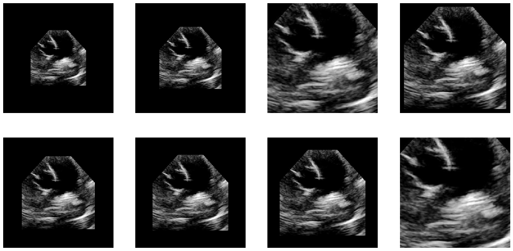


```python
img = []
for i in range(8):
    img.append(im)
img = np.array(img)
seq = iaa.Sequential([iaa.Affine(translate_px={"x": (-50, 50), "y": (-50, 50)})])#平移
img = seq(images = img)
plt.figure(figsize=(20,10))
for i in range(8):
    plt.subplot(2,4,i+1)
    plt.axis('off')
    plt.imshow(img[i])
plt.show()
```


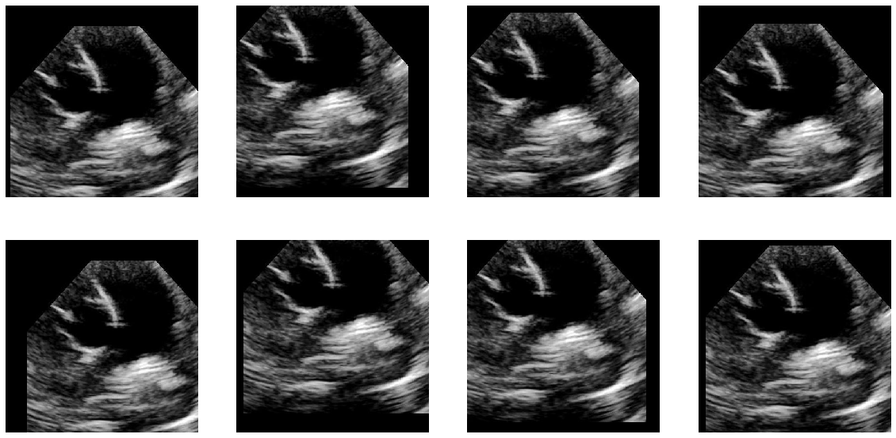


```python
img = []
for i in range(8):
    img.append(im)
img = np.array(img)
seq = iaa.Sequential([iaa.Affine(shear=(-16, 16))])#shear
img = seq(images = img)
plt.figure(figsize=(20,10))
for i in range(8):
    plt.subplot(2,4,i+1)
    plt.axis('off')
    plt.imshow(img[i])
plt.show()
```


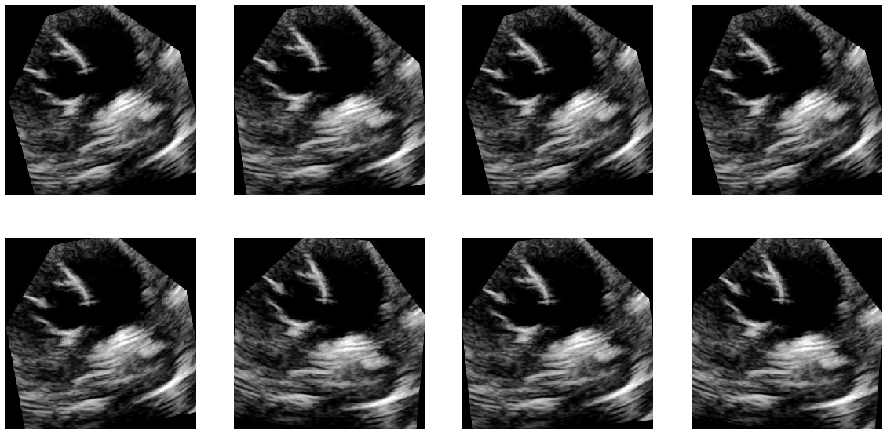


```python
img = []
for i in range(8):
    img.append(im)
img = np.array(img)
seq = iaa.Sequential([iaa.pillike.EnhanceBrightness()])#亮度
img = seq(images = img)
plt.figure(figsize=(20,10))
for i in range(8):
    plt.subplot(2,4,i+1)
    plt.axis('off')
    plt.imshow(img[i])
plt.show()
```


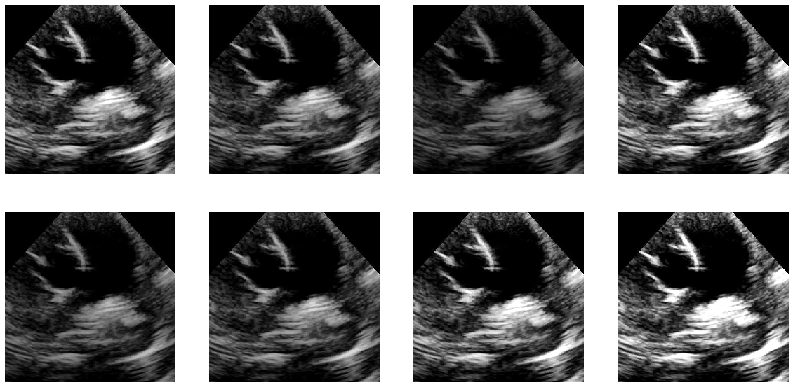


```python
img = []
for i in range(8):
    img.append(im)
img = np.array(img)
seq = iaa.Sequential([iaa.pillike.EnhanceSharpness()])#锐化模糊
img = seq(images = img)
plt.figure(figsize=(20,10))
for i in range(8):
    plt.subplot(2,4,i+1)
    plt.axis('off')
    plt.imshow(img[i])
plt.show()
```


